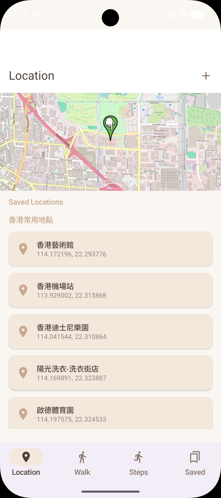
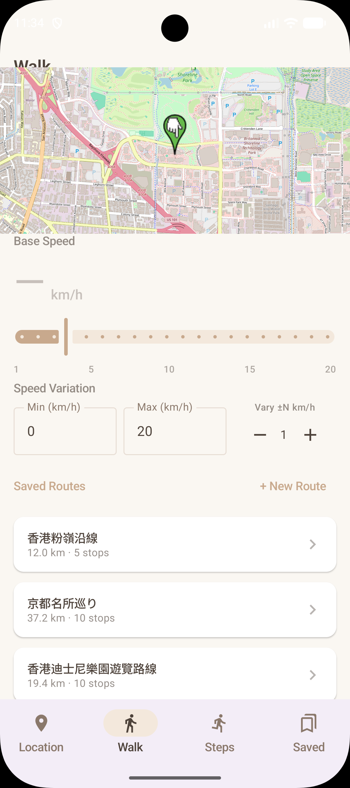
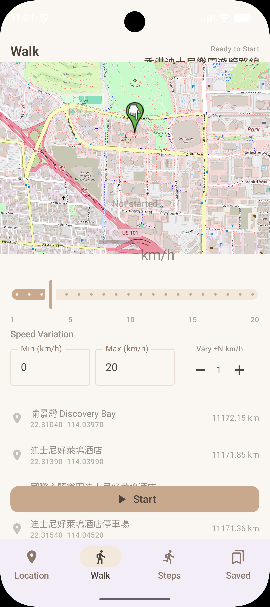
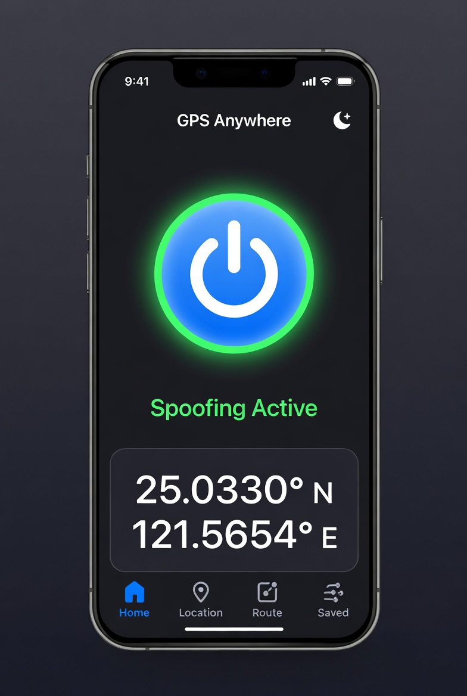
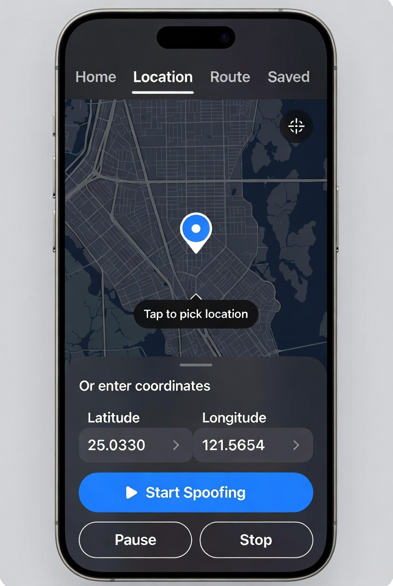
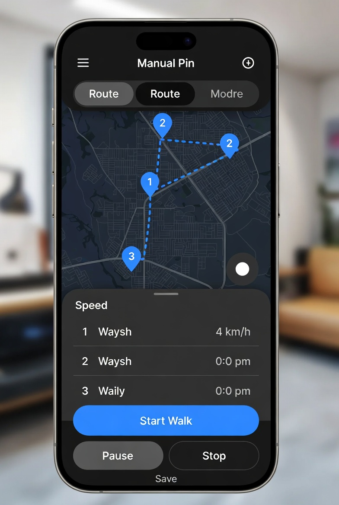
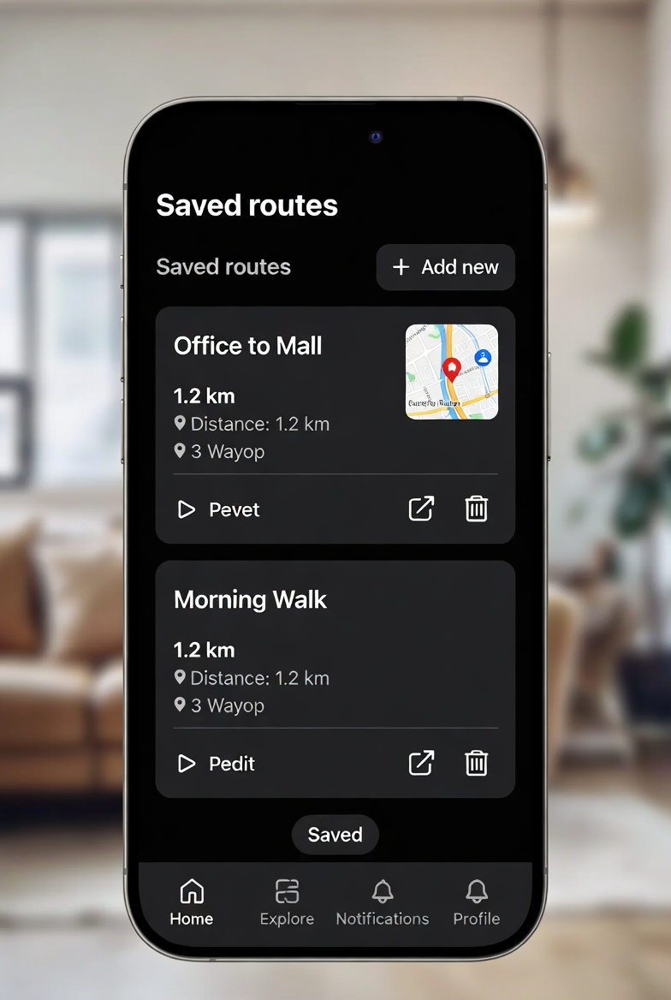

# GPS Anywhere

**A developer-focused Android app for testing mock GPS locations and route simulation.**  
**專為開發者與測試人員設計的 Android GPS 模擬與路線模擬工具。**

> **For development & testing use only. 僅供開發與測試用途。**  
> GPS spoofing may violate other apps' terms of service or local laws. Use responsibly.  
> GPS 模擬可能違反其他 App 的服務條款或當地法規，請負責任地使用。

---

## ✨ Screenshots 應用介面展示

### 📸 App Screenshots 實際應用截圖

Screenshots from the running app (June 2026).  
以下為實際執行中的 App 截圖。

| Location 位置 | Walk — route list 路線列表 | Walk — route detail 路線詳情 |
|---------------|------------------------------|--------------------------------|
| Regional saved locations, map preview, Jump to spoof | Saved routes with distance and stops | Waypoint list, speed controls, Start walk |

<p align="center">
  
  
  
</p>

**Location 位置** — Map preview, bundled locations by region (Hong Kong, Taiwan, Japan), custom locations, **Jump** to spoof, yellow highlight for active GPS match.  
地圖預覽、依地區分類的內建位置、自訂位置、**Jump** 跳轉模擬、黃色標示目前 GPS 對應位置。

**Walk 步行** — Pick a saved or default route, adjust speed, start route simulation.  
選擇已儲存或預設路線、調整速度、開始路線模擬。

---

### 🎨 UI Design Mockups 介面設計稿

> These mockups show the intended product direction. Built status reflects current implementation,  
> not screenshot accuracy. 以下為目標介面設計稿；建置狀態代表目前實作進度，不代表截圖已完全對應。

| Home | Location | Route | Saved Routes |
|------|----------|-------|--------------|
| ✅ Built | ✅ Built | 🔄 Planned | 🔄 Planned |

<p align="center">
  
  
  
  
</p>

**Home 首頁** — Master ON/OFF toggle to switch between real GPS and spoofed location, shows current coordinates when active, theme switcher.  
主開關用於切換真實 GPS 與模擬定位，啟動時顯示目前座標，附主題切換。  

**Location 位置** — OSMDroid map, tap-to-pin, paste from Google Maps, Start / Pause / Stop, location history.  
OSMDroid 地圖、點擊標記、Google Maps 座標貼上、開始/暫停/停止、位置歷史。  

**Route 路線** *(coming in Session 3 / Session 3 開發)* — Manual numbered pins, OSRM auto-route, walking speed slider.  
手動編號標點、OSRM 自動路線、步行速度調整。  

**Saved Routes 已儲存路線** *(coming in Session 4 / Session 4 開發)* — Named routes with map thumbnail, distance, Play / Edit / Delete.  
命名路線、地圖縮圖、距離、播放/編輯/刪除。

---

## 📋 Features 主要功能

- **Master Spoofing Toggle 主要模擬開關**  
  One-tap enable/disable GPS spoofing with a large prominent button.  
  大型醒目的一鍵啟停按鈕。

- **Set Mock Location 設定模擬位置**  
  Tap on map, paste from Google Maps, or manually input coordinates.  
  點擊地圖、從 Google Maps 貼上，或手動輸入經緯度。

- **Recent Locations 最近位置記錄**  
  Auto-saved history with swipe-to-delete, rename, and quick restore.  
  自動儲存歷史，支援滑動刪除、重新命名與快速還原。

- **Walk Route Simulation 步行路線模擬** *(planned 開發中)*  
  Manual waypoints, OSRM auto-route, adjustable speed.  
  手動標點、OSRM 自動路線、可調整步行速度。

- **Saved Routes 已儲存路線** *(planned 開發中)*  
  Save, edit, and replay custom routes.  
  儲存、編輯與快速載入自訂路線。

- **Background Service 背景服務**  
  Persistent notification with stop control.  
  前台通知欄常駐，可直接停止。

- **Modern UI 現代介面**  
  Material You design with Light/Dark/System theme support.  
  採用 Material You 設計，支援 Light Dark System 模式。

---

## 🛠 Tech Stack 技術堆疊

| Layer | Library |
|-------|---------|
| **Language 程式語言** | Kotlin |
| **UI Framework 介面框架** | Jetpack Compose + Material 3 |
| **Map 地圖** | OSMDroid (no Google Play Services) |
| **Routing 路線生成** | OSRM (Open Source Routing Machine) — free, no API key |
| **Database 資料庫** | Room (KSP) |
| **Mock Location 模擬定位** | `LocationManager.addTestProvider()` |
| **Background 背景服務** | Android Foreground Service |
| **Theme 主題** | AppCompat `setDefaultNightMode` + Compose |

**Min SDK:** API 24 (Android 7.0)  
**Package:** `com.gpsanywhere.app`

---

## 🚀 Getting Started 快速開始

### 1. Clone and open 複製與開啟專案

```bash
git clone <your-repo-url>
```

Open the project in Android Studio (Ladybug or later recommended).  
使用 Android Studio 開啟專案（建議 Ladybug 或更新版本）。

### 2. Device setup — required before the app works 裝置設定（必要步驟）

The app uses Android's mock location API. You **must** configure your device first.  
App 使用 Android 模擬定位 API，請先完成以下裝置設定：

1. Enable **Developer Options** 啟用 **開發人員選項**
   - Go to *Settings → About Phone* 前往 *設定 → 關於手機*
   - Tap **Build Number** 7 times 連續點擊 **版本號碼** 7 次
2. Go to *Settings → Developer Options* 前往 *設定 → 開發人員選項*
3. Find **Select Mock Location App** 找到 **選取模擬位置 App**
4. Choose **GPS Anywhere** 選擇 **GPS Anywhere**

> Without this step the app installs but spoofing will silently do nothing.  
> 若未完成此步驟，App 可安裝但模擬定位不會生效。

### 3. Build and run 編譯與執行

```bash
./gradlew assembleDebug
```

Or press **Run** in Android Studio. 或直接在 Android Studio 按下 **Run**。

---

## 📖 How to Use 使用說明

### Set a Fixed Location 設定固定位置

1. Open the **Location** tab. 開啟 **Location** 分頁。
2. Pick a location in one of three ways. 使用以下任一方式選擇位置：
   - **Tap the map** to drop a pin. **點擊地圖** 放置標記。
   - **Paste** a coordinate copied from Google Maps (`25.0457, 121.5764` format).  
     **貼上** 從 Google Maps 複製的座標（格式如 `25.0457, 121.5764`）。
   - **Type** latitude and longitude manually. **手動輸入** 緯度與經度。
3. Tap **Start Spoofing**. 點擊 **Start Spoofing**。
4. Use **Pause** to temporarily restore real GPS without ending the session.  
   使用 **Pause** 暫時恢復真實 GPS，但保留目前工作階段。
5. Tap **Stop** to restore real GPS permanently. 點擊 **Stop** 停止模擬並恢復真實 GPS。

### Recent Locations 最近位置

- Every successfully started location is saved to a history list at the bottom of the Location tab.  
  每次成功啟動的位置都會儲存在 Location 分頁底部的歷史列表。
- **Tap** any entry to load it back into the map and fields.  
  **點擊** 任一項目可還原到地圖與輸入欄位。
- **Swipe left** or tap **×** to delete an entry. **向左滑動** 或點擊 **×** 可刪除單筆記錄。
- Tap the **pencil icon** to give it a name, such as "Home" or "Office".  
  點擊 **鉛筆圖示** 可命名，例如「Home」或「Office」。
- **Clear all** removes the full history. **Clear all** 會清除全部歷史。

### Home Screen 首頁畫面

- The big **power button** is the master toggle: OFF = real GPS, ON = spoofing active.  
  大型 **電源按鈕** 為主開關：關閉 = 使用真實 GPS，開啟 = 模擬定位生效。
- When spoofing is active, the current spoofed coordinates are shown.  
  模擬定位啟動時會顯示目前模擬座標。
- The **theme icon** (top-right) cycles between System / Light / Dark.  
  **主題圖示**（右上角）可在 System / Light / Dark 間切換。

---

## 📁 Project Structure 專案結構

```
app/src/main/java/com/gpsanywhere/app/
├── ui/
│   ├── home/           HomeScreen.kt
│   ├── location/       LocationScreen.kt
│   ├── route/          RouteScreen.kt
│   ├── saved/          SavedRoutesScreen.kt
│   ├── onboarding/     OnboardingDialog.kt
│   ├── components/     PowerToggleButton, CoordinateCard, MapViewComposable
│   ├── navigation/     MainApp.kt, Routes.kt, RouteEditHolder.kt
│   └── theme/          Color.kt, Type.kt, Theme.kt
├── viewmodel/
│   ├── MainViewModel.kt
│   ├── LocationViewModel.kt
│   ├── RouteViewModel.kt
│   └── SavedRoutesViewModel.kt
├── service/
│   └── SpoofService.kt         ← Foreground service, mock location provider
├── data/
│   ├── AppDatabase.kt
│   ├── RouteDao.kt
│   ├── SavedRoute.kt
│   └── WaypointJson.kt
├── settings/
│   ├── AppPreferences.kt       ← Theme, onboarding, compliance flags
│   ├── LocationHistoryStore.kt ← Recent locations (SharedPrefs + Gson)
│   └── ThemeMode.kt
├── directions/
│   └── OsrmClient.kt           ← OSRM walking route fetcher
└── routes/
    └── LocationPoint.kt
```

---

## 🔐 Permissions 權限說明

The app requests the following Android permissions. App 會請求以下 Android 權限：

| Permission | Why 用途 |
|------------|------------|
| `ACCESS_FINE_LOCATION` | Read current GPS for map centering. 讀取目前 GPS 以置中地圖。 |
| `ACCESS_COARSE_LOCATION` | Fallback location. 備用粗略定位。 |
| `ACCESS_MOCK_LOCATION` | Inject mock GPS coordinates. 注入模擬 GPS 座標。 |
| `FOREGROUND_SERVICE` | Keep spoofing alive in the background. 讓模擬定位可在背景持續執行。 |
| `FOREGROUND_SERVICE_LOCATION` | Required on Android 10+ for location foreground services. Android 10+ 位置前台服務所需。 |
| `POST_NOTIFICATIONS` | Show the persistent spoofing notification on Android 13+. Android 13+ 顯示常駐通知所需。 |
| `INTERNET` | Load OSMDroid map tiles and fetch OSRM routes. 載入 OSMDroid 地圖圖磚與 OSRM 路線。 |
| `ACCESS_NETWORK_STATE` | Check connectivity before OSRM requests. 呼叫 OSRM 前檢查網路狀態。 |

---

## ⚙️ Known Build Notes (AGP 9 + Kotlin 2.0) 已知建置注意事項

- Do **not** add `org.jetbrains.kotlin.android` plugin — AGP 9 bundles Kotlin and will error.  
  不要加入 `org.jetbrains.kotlin.android` plugin，AGP 9 已內建 Kotlin，否則會衝突。
- Compose requires `org.jetbrains.kotlin.plugin.compose` as a separate plugin.  
  Compose 需要獨立加入 `org.jetbrains.kotlin.plugin.compose`。
- Room requires KSP (`ksp(libs.androidx.room.compiler)`) — not kapt. Room 使用 KSP，不使用 kapt。
- Add `android.disallowKotlinSourceSets=false` to `gradle.properties` to avoid KSP source set conflicts.  
  在 `gradle.properties` 加入此設定以避免 KSP source set 衝突。
- `kotlinOptions { jvmTarget }` is removed in AGP 9 — use only `compileOptions`.  
  AGP 9 已移除 `kotlinOptions { jvmTarget }`，請只使用 `compileOptions`。

---

## 🗺 Roadmap 開發路線圖

- [ ] **Session 3** — Walk route simulation with smooth GPS interpolation.  
  具備平滑 GPS 插值的步行路線模擬。
- [ ] **Session 4** — Saved routes with static map thumbnails. 已儲存路線與靜態地圖縮圖。
- [ ] **Session 5** — Polish existing background notification with live route progress.  
  強化現有背景通知，加入即時路線進度。
- [ ] **Session 6** — Settings/About screen, final light/dark polish.  
  設定/關於頁面與 Light/Dark 最終調整。

---

## 📄 Usage Notice 使用聲明

This project is for **educational and development testing purposes only**.  
本專案僅供教育與開發測試用途。

---

*Built with ❤️ using Jetpack Compose and OSMDroid.*
