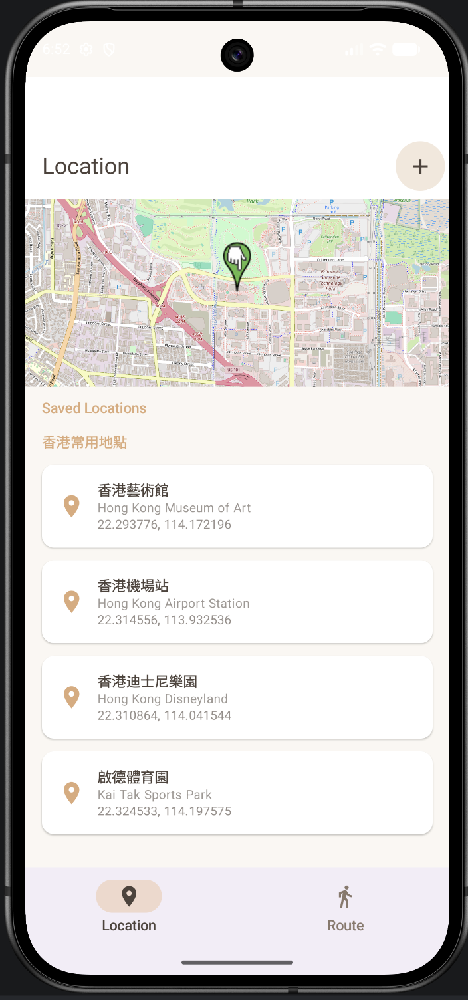
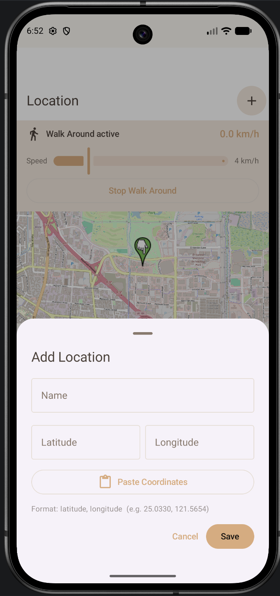
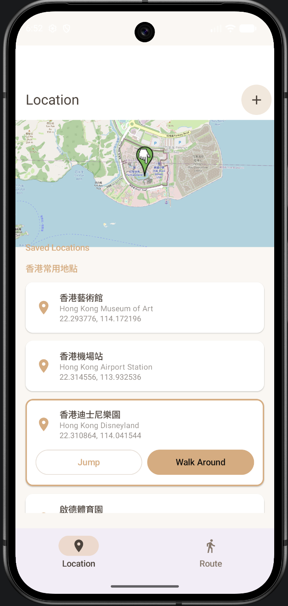
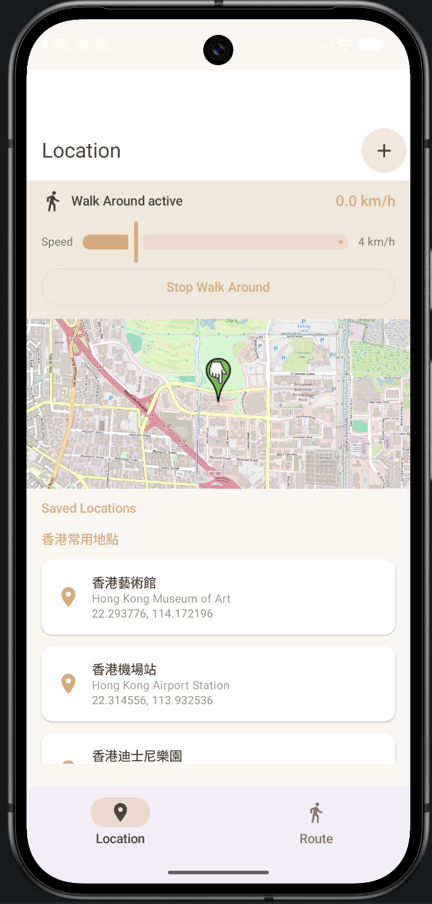
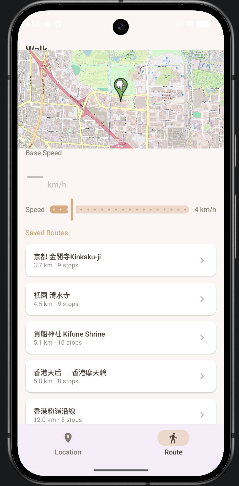
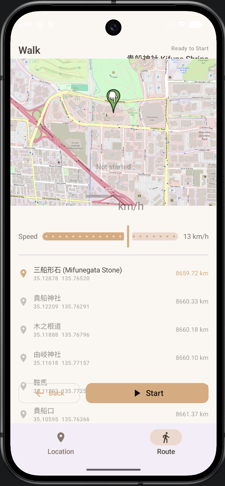

# GPS Anywhere

** Virtually Walk Around The World On Android Phone**

> **For development & testing use only. **  
> GPS spoofing may violate other apps' terms of service or local laws. Use responsibly.  
> GPS 模擬可能違反其他 App 的服務條款或當地法規，請負責任地使用。

---

## ✨ Screenshots

### 📸 App Screenshots & Explain


### Location

Edit your Android GPS location to anywhere you like !
- Just jump to it
 or 
- Walk around it spiral way 

You can add your custom location by clicking the "+" button on top right corner
<p align="center">
  
  
  
  
</p>

### Route
Follow the prebuild route. [Unfortunately Edit function coming soon. Working on it]
<p align="center">
  
  &nbsp;&nbsp;
  
</p>

**Walk Mode** — Base speed slider (1–20 km/hr with tick marks), Speed vary by ±1 km/hr

---

## 🚀 Quick Start

### Prerequisites

- Android Studio (Ladybug or later)
- A device or emulator running Android 8.0+ (API 26)

### 1. Clone

```bash
git clone https://github.com/your-username/gpsanywhere.git
```

### 2. Configure Your Device

This step is **required** — without it, the app installs fine but spoofing silently does nothing.

1. Go to **Settings > About Phone** and tap **Build Number** 7 times to unlock Developer Options.
2. Go to **Settings > Developer Options > Select Mock Location App**.
3. Choose **GPS Anywhere**.

### 3. Build & Run

```bash
./gradlew assembleDebug
```

Or hit **Run** in Android Studio.

---

---

## 🛠 Tech Stack

| Component | Choice |
|-----------|--------|
| Language | Kotlin 2.0 |
| UI | Jetpack Compose + Material 3 |
| Maps | OSMDroid — no Google Play Services dependency |
| Routing | OSRM (free, no API key) |
| Database | Room with KSP |
| Mock GPS | `LocationManager.addTestProvider()` |
| Background | Android Foreground Service |
| Networking | OkHttp + Gson |
| Build | AGP 9, Gradle version catalog |

**Target SDK:** 36 &nbsp;|&nbsp; **Min SDK:** 26 (Android 8.0)

---

---

## 📁 Project Structure

```
```

---

## 🔐 Permissions

The app requests the following Android permissions.

| Permission | Purpose |
|------------|---------|
| `ACCESS_FINE_LOCATION` | Centre map on real GPS |
| `ACCESS_COARSE_LOCATION` | Fallback location |
| `ACCESS_MOCK_LOCATION` | Inject fake coordinates |
| `FOREGROUND_SERVICE` | Keep spoofing alive in background |
| `FOREGROUND_SERVICE_LOCATION` | Required on Android 10+ |
| `POST_NOTIFICATIONS` | Persistent notification on Android 13+ |
| `INTERNET` | Map tiles + OSRM route fetching |
| `ACCESS_NETWORK_STATE` | Pre-flight connectivity check |

---

## ⚙️ Build Notes

This project uses **AGP 9 + Kotlin 2.0**, which has some sharp edges:

- **Do not** add the `org.jetbrains.kotlin.android` plugin — AGP 9 bundles Kotlin internally and will throw a "duplicate extension" error.
- Compose needs `org.jetbrains.kotlin.plugin.compose` as a separate plugin.
- Room uses KSP, not kapt: `ksp(libs.androidx.room.compiler)`.
- Add `android.disallowKotlinSourceSets=false` to `gradle.properties` to avoid KSP source set conflicts.
- `kotlinOptions { jvmTarget }` no longer exists in AGP 9 — use `compileOptions` only.
- GPS Anywhere uses OSMDroid for maps and OSRM for route data. The public OSRM server is free and does not need an API key, but it is rate-limited and intended for light usage. For heavy or commercial use, self-host OSRM or switch to a routing backend you control.
---

## 📄 Usage Notice , Responsible Use, Disclaimer

Educational and internal testing use only. Do not use it to bypass location restrictions, misrepresent your location to services, or gain unfair advantages in apps or games. 
Respect the terms of any apps or services you interact with while using simulated locations.
