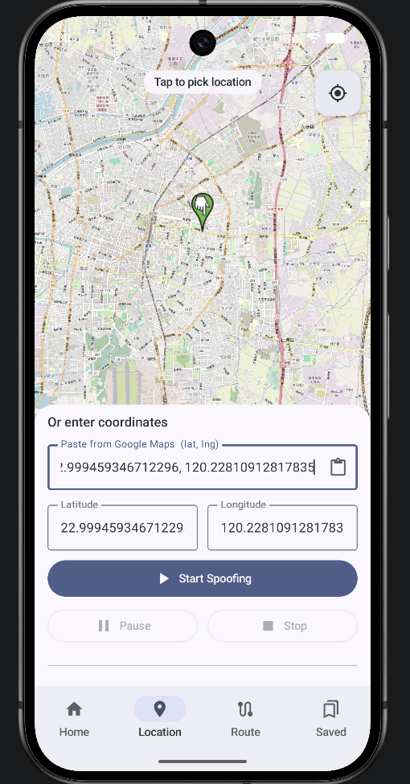

# GPS Anywhere（GPS Anywhere）

**A powerful GPS spoofing and route simulation tool for Android developers and testers.**  
**一款強大的 Android GPS 模擬與路線模擬工具，專為開發者與測試人員設計。**

> **For development & testing use only.** GPS spoofing may violate the terms of service of other apps and local laws. Use responsibly.

---

## ✨ Screenshots / 應用介面展示

### 📸 App Screenshots / 實際應用截圖

Real captures from the running app.

<p align="center">
  
</p>

---

### 🎨 UI Design Mockups / 介面設計稿

> These are the target mockups. Screens marked 🔄 are not yet implemented.

| Home | Location | Route | Saved Routes |
|------|----------|-------|--------------|
| ✅ Built | ✅ Built | 🔄 Planned | 🔄 Planned |

<p align="center">
  
  
  
  
</p>

**Home** — Big power toggle, live coordinate card, theme switcher.  
**Location** — OSMDroid map, tap-to-pin, paste from Google Maps, Start / Pause / Stop, location history.  
**Route** *(coming in Session 3)* — Manual numbered pins, OSRM auto-route, walking speed slider.  
**Saved Routes** *(coming in Session 4)* — Named routes with map thumbnail, distance, Play / Edit / Delete.

---

## 📋 Features / 主要功能

### English
- **Master Spoofing Toggle** — One-tap enable/disable GPS spoofing with large prominent button.
- **Set Mock Location** — Tap on map, paste from Google Maps, or manually input coordinates.
- **Recent Locations** — Auto-saved history with swipe-to-delete, rename, and quick restore.
- **Walk Route Simulation** *(planned)* — Manual waypoints, OSRM auto-route (free), adjustable speed.
- **Saved Routes** *(planned)* — Save, edit, and replay custom routes.
- **Background Service** — Persistent notification with stop control.
- **Modern UI** — Material You design with Light/Dark/System theme support.

### 繁體中文
- **主要模擬開關** — 大型醒目的一鍵啟停按鈕。
- **設定模擬位置** — 點擊地圖、從 Google Maps 貼上，或手動輸入經緯度。
- **最近位置記錄** — 自動儲存歷史，支援滑動刪除、重新命名與快速還原。
- **步行路線模擬** *(開發中)* — 手動標點、OSRM 自動路線生成（免費）、可調整步行速度。
- **已儲存路線** *(開發中)* — 儲存、編輯與快速載入路線。
- **背景服務** — 前台通知欄常駐，可直接停止。
- **現代介面** — 採用 Material You 設計，支援 Light / Dark / System 模式。

---

## 🛠 Tech Stack / 技術堆疊

| Layer | Library |
|-------|---------|
| **Language / 程式語言** | Kotlin |
| **UI Framework / 介面框架** | Jetpack Compose + Material 3 |
| **Map / 地圖** | OSMDroid (no Google Play Services) |
| **Routing / 路線生成** | OSRM (Open Source Routing Machine) — free, no API key |
| **Database / 資料庫** | Room (KSP) |
| **Mock Location / 模擬定位** | `LocationManager.addTestProvider()` |
| **Background / 背景服務** | Android Foreground Service |
| **Theme / 主題** | AppCompat `setDefaultNightMode` + Compose |

**Min SDK:** API 24 (Android 7.0)  
**Package:** `com.gpsanywhere.app`

---

## 🚀 Getting Started / 快速開始

### 1. Clone and open / 複製與開啟專案

```bash
git clone <your-repo-url>
```

Open the project in Android Studio (Ladybug or later recommended).

### 2. Device setup — required before the app works / 裝置設定（必要步驟）

The app uses Android's mock location API. You **must** configure your device first:

1. Enable **Developer Options**
   - Go to *Settings → About Phone*
   - Tap **Build Number** 7 times
2. Go to *Settings → Developer Options*
3. Find **Select Mock Location App**
4. Choose **GPS Anywhere**

> Without this step the app installs but spoofing will silently do nothing.

### 3. Build and run / 編譯與執行

```bash
./gradlew assembleDebug
```

Or press **Run** in Android Studio.

---

## 📖 How to Use / 使用說明

### Set a Fixed Location / 設定固定位置

1. Open the **Location** tab
2. Pick a location — any of three ways:
   - **Tap the map** to drop a pin
   - **Paste** a coordinate copied from Google Maps (`25.0457, 121.5764` format)
   - **Type** latitude and longitude manually
3. Tap **Start Spoofing**
4. Use **Pause** to temporarily restore real GPS without ending the session
5. Tap **Stop** to restore real GPS permanently

### Recent Locations / 最近位置

- Every successfully started location is saved to a history list at the bottom of the Location tab
- **Tap** any entry to load it back into the map and fields
- **Swipe left** or tap **×** to delete an entry
- Tap the **pencil icon** to give it a name (e.g. "Home", "Office")
- **Clear all** removes the full history

### Home Screen / 首頁畫面

- The big **power button** toggles spoofing on/off
- When active, the current spoofed coordinates are shown
- The **theme icon** (top-right) cycles between System / Light / Dark

---

## 📁 Project Structure / 專案結構

```
app/src/main/java/com/gpsanywhere/app/
├── ui/
│   ├── home/           HomeScreen.kt
│   ├── location/       LocationScreen.kt
│   ├── route/          RouteScreen.kt
│   ├── saved/          SavedRoutesScreen.kt
│   ├── onboarding/     OnboardingDialog.kt
│   ├── components/     PowerToggleButton, CoordinateCard, MapViewComposable
│   ├── navigation/     MainApp.kt, Routes.kt
│   └── theme/          Color.kt, Type.kt, Theme.kt
├── viewmodel/
│   ├── MainViewModel.kt
│   ├── LocationViewModel.kt
│   ├── RouteViewModel.kt
│   └── SavedRoutesViewModel.kt
├── service/
│   └── SpoofService.kt         ← Foreground service, mock location provider
├── data/
│   ├── AppDatabase.kt
│   ├── RouteDao.kt
│   ├── SavedRoute.kt
│   └── WaypointJson.kt
├── settings/
│   ├── AppPreferences.kt       ← Theme, onboarding, compliance flags
│   ├── LocationHistoryStore.kt ← Recent locations (SharedPrefs + Gson)
│   └── ThemeMode.kt
├── directions/
│   └── OsrmClient.kt           ← OSRM walking route fetcher
└── routes/
    └── LocationPoint.kt
```

---

## 🔐 Permissions / 權限說明

The app requests the following Android permissions:

| Permission | Why |
|------------|-----|
| `ACCESS_FINE_LOCATION` | Read current GPS for map centering |
| `ACCESS_COARSE_LOCATION` | Fallback location |
| `ACCESS_MOCK_LOCATION` | Inject mock GPS coordinates |
| `FOREGROUND_SERVICE` | Keep spoofing alive in the background |
| `FOREGROUND_SERVICE_LOCATION` | Required on Android 10+ for location foreground services |
| `POST_NOTIFICATIONS` | Show the persistent spoofing notification on Android 13+ |
| `INTERNET` | Load OSMDroid map tiles and fetch OSRM routes |
| `ACCESS_NETWORK_STATE` | Check connectivity before OSRM requests |

---

## ⚙️ Known Build Notes (AGP 9 + Kotlin 2.0) / 已知建置注意事項

- Do **not** add `org.jetbrains.kotlin.android` plugin — AGP 9 bundles Kotlin and will error
- Compose requires `org.jetbrains.kotlin.plugin.compose` as a separate plugin
- Room requires KSP (`ksp(libs.androidx.room.compiler)`) — not kapt
- Add `android.disallowKotlinSourceSets=false` to `gradle.properties` to avoid KSP source set conflicts
- `kotlinOptions { jvmTarget }` is removed in AGP 9 — use only `compileOptions`

---

## 🗺 Roadmap / 開發路線圖

- [ ] **Session 3** — Walk route simulation with smooth GPS interpolation
- [ ] **Session 4** — Saved routes with static map thumbnails
- [ ] **Session 5** — Polished background notification with live progress
- [ ] **Session 6** — Settings/About screen, final light/dark polish

---

## 📄 License

This project is for **educational and development testing purposes only**.  
本專案僅供教育與開發測試用途。

---

*Built with ❤️ using Jetpack Compose and OSMDroid.*
