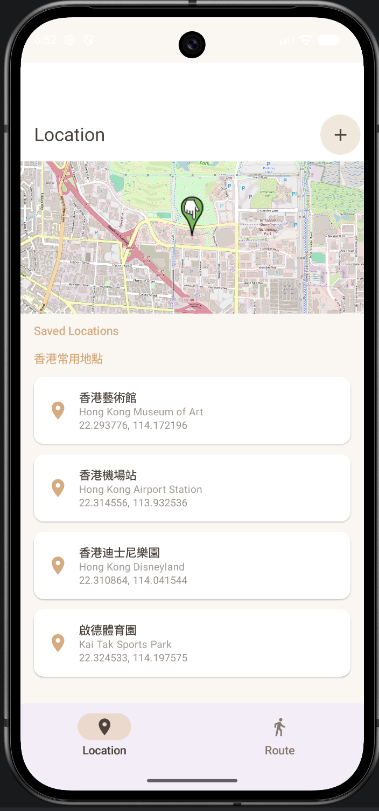
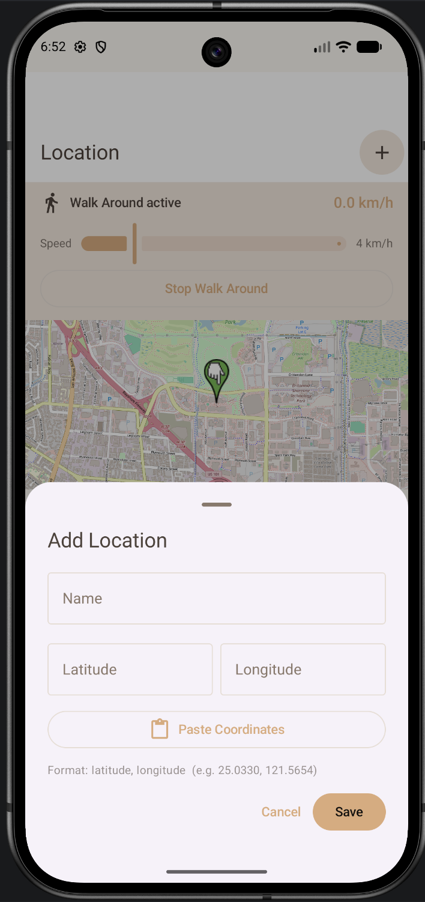
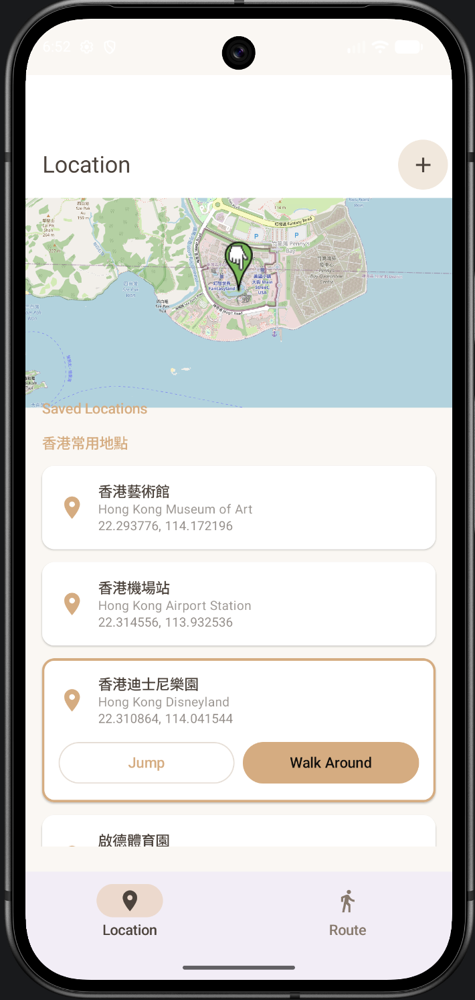
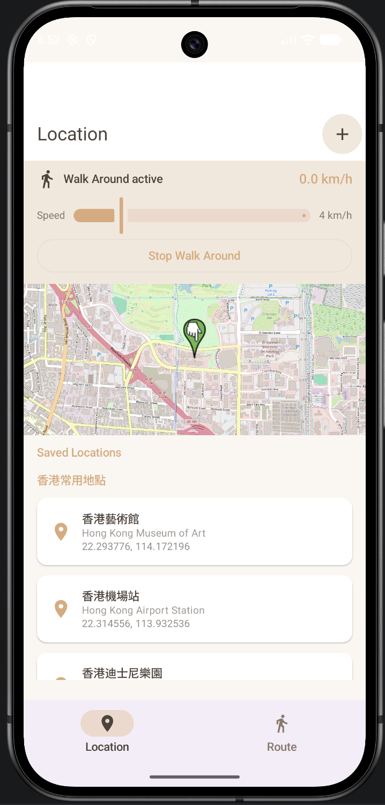
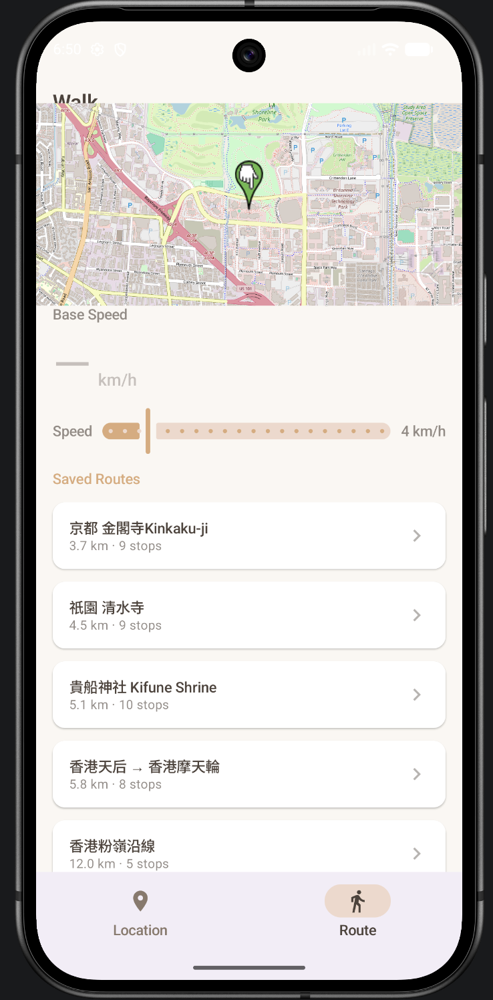
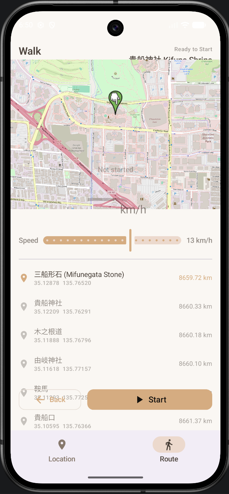

# GPS Anywhere

**Virtually walk around the world from your Android phone**

> **For development & testing use only.**  
> GPS spoofing may violate other apps' terms of service or local laws. Use responsibly.  
> GPS 模擬可能違反其他 App 的服務條款或當地法規，請負責任地使用。

---

## 📸 Overview

### Location

Set your Android GPS location anywhere you want. Three transport buttons, all
disabled until you pick a saved place or type a coordinate:

| Button | What it does |
|---|---|
| **Jump** | Teleport to the point and stay there. |
| **Walk Around** | Wander in a spiral around the point, resetting every 10 minutes. |
| **Max-Speed Travel** | Travel there from where you are at high speed, then wander. |

The **speed control** sets the base wander speed; the actual speed drifts around
it by ±1 km/h so the track doesn't look machine-generated. Its slider is
non-linear — walking speeds get the first 80% of the track, because that's the
range worth fine-tuning. Note that Max-Speed Travel resets the control to its
default when you tap it.

Nudge the spoofed position with the on-screen direction pad.

Add a custom location with the **+** button on the map: coordinates (typed or
pasted), plus **name and tags in both Chinese and English**. Whichever pair
matches the app language is what the list shows, falling back to the other if
one is left blank. Every location — including imported prebuilt ones — can be
edited or deleted.
<p align="center">
  
  
  
  
</p>

### Route
Follow a route along a series of waypoints.

- **Create & edit routes** — tap the **+** on the Route tab to open the route editor:
  add waypoints by tapping the map or pasting coordinates, reorder or delete them,
  then save. Edit or delete any route (including prebuilt ones) from the list.
- **While walking** — Back, Revert (reverse direction from the current point),
  Pause/Resume, and Stop. Tap a waypoint name to jump there and keep walking.
<p align="center">
  
  &nbsp;&nbsp;
  
</p>

**Speed** — non-linear slider, deliberately tuned apart from the Location tab's:
this one tops out at 300 km/h with 20 and 100 km/h as intermediate stops, because
a route is walked rather than jumped to.

### Settings

- **Language** — System / English / 繁體中文. Location and route names and tags
  follow this setting, not just the interface text.
- **Theme** — Light / Dark, two hand-tuned palettes rather than one inverted:
  light is a warm autumn set on cream, dark an ember set on steel blue.
- **Prebuilt Data** — the app ships with sample locations & routes but does **not**
  import them automatically. Use **Import Prebuilt Locations & Routes** to add them,
  or the delete buttons to clear prebuilt locations / all custom data.
- **Open Developer Options** — shortcut to pick this app as the mock-location app.
- **How to Use** — what each transport button does, since a door, a walking figure
  and a rocket don't explain themselves.

---

## 🧭 Getting Started (Using the App)

1. **Install the app** (build it yourself — see Quick Start below — or install a debug APK).
2. **Enable mock locations** (one-time, required):
   - **Settings → About Phone → tap Build Number 7×** to unlock Developer Options.
   - **Settings → Developer Options → Select mock location app → GPS Anywhere.**
   - Or, in-app, go to **Settings → Open Developer Options** for a shortcut.
3. **Grant location permission** when the app asks.
4. **Import sample data (optional)** — fresh installs start empty. Go to
   **Settings → Prebuilt Data → Import Prebuilt Locations & Routes** to load the
   bundled places and routes. You can delete them anytime.
5. **Spoof a location** — on the **Location** tab, tap a place (or add your own with **+**),
   then choose **Jump**, **Walk Around**, or **Max-Speed Travel**. Use the direction pad to nudge.
6. **Walk a route** — on the **Route** tab, pick a route and press **Start**, or tap **+**
   to create your own by tapping the map / pasting coordinates. While walking you can
   Pause, Revert direction, or tap a stop to jump ahead.
7. **Stop** anytime with the Stop button; your GPS stays at the last spoofed point.

> Tip: confirm it works by opening Google Maps — the blue dot should be where you set it.

---

## 🚀 Quick Start

### Prerequisites

- Android Studio (Ladybug or later)
- A device or emulator running Android 8.0+ (API 26)

### 1. Clone

```bash
git clone https://github.com/codekaburra/andriod-gps-anywhere.git
```

### 2. Configure Your Device

This step is **required** — without it, the app installs fine but spoofing silently does nothing.

1. Go to **Settings > About Phone** and tap **Build Number** 7 times to unlock Developer Options.
2. Go to **Settings > Developer Options > Select Mock Location App**.
3. Choose **GPS Anywhere**.

### 3. Build & Run

```bash
./gradlew assembleDebug
```

Or hit **Run** in Android Studio.

---

## 🛠 Tech Stack

| Component | Choice |
|-----------|--------|
| Package | `com.gpsanywhere.app` |
| Language | Kotlin + Jetpack Compose |
| UI | Jetpack Compose + Material 3 |
| Maps | OSMDroid — no Google Play Services dependency |
| Routing | OSRM (free, no API key) |
| Database | Room with KSP |
| Mock GPS | `LocationManager.addTestProvider()` |
| Background | Android Foreground Service |
| Networking | OkHttp + Gson |
| Build | AGP 9, Gradle version catalog |

**Target SDK:** 36 &nbsp;|&nbsp; **Min SDK:** 26 (Android 8.0)

---

## 📁 Project Structure

```
app/src/main/
├── assets/
│   ├── saved_locations/     # bundled sample places (CSV, bilingual)
│   └── saved_routes/        # bundled sample routes (CSV, bilingual)
├── java/com/gpsanywhere/app/
│   ├── data/                # Room entities, DAOs, migrations, CSV seeders
│   ├── location/            # real-GPS provider
│   ├── routes/              # waypoint model, OSRM client, spiral generator
│   ├── service/             # SpoofService — the foreground mock-location service
│   ├── settings/            # language & theme preferences
│   ├── ui/
│   │   ├── components/      # shared controls: buttons, dialogs, map header, fields
│   │   ├── location/        # Location tab
│   │   ├── walk/            # Route tab and the route editor
│   │   ├── settings/        # Settings tab
│   │   ├── onboarding/      # first-run setup dialog
│   │   ├── navigation/      # scaffold and bottom bar
│   │   └── theme/           # Color.kt / Theme.kt — every colour role
│   ├── util/                # clipboard coordinate parsing
│   └── viewmodel/
└── res/                     # strings in values/ and values-zh-rTW/
```

---

## 🔐 Permissions

The app requests the following Android permissions.

| Permission | Purpose |
|------------|---------|
| `ACCESS_FINE_LOCATION` | Centre map on real GPS |
| `ACCESS_COARSE_LOCATION` | Fallback location |
| `ACCESS_MOCK_LOCATION` | Inject fake coordinates |
| `FOREGROUND_SERVICE` | Keep spoofing alive in background |
| `FOREGROUND_SERVICE_LOCATION` | Required on Android 10+ |
| `POST_NOTIFICATIONS` | Persistent notification on Android 13+ |
| `INTERNET` | Map tiles + OSRM route fetching |
| `ACCESS_NETWORK_STATE` | Pre-flight connectivity check |

---

## ⚙️ Build Notes

This project uses **AGP 9 + the Compose compiler plugin**, which has some sharp edges:

- **Do not** add the `org.jetbrains.kotlin.android` plugin — AGP 9 bundles Kotlin internally and will throw a "duplicate extension" error.
- Compose needs `org.jetbrains.kotlin.plugin.compose` as a separate plugin.
- Room uses KSP, not kapt: `ksp(libs.androidx.room.compiler)`.
- Add `android.disallowKotlinSourceSets=false` to `gradle.properties` to avoid KSP source set conflicts.
- `kotlinOptions { jvmTarget }` no longer exists in AGP 9 — use `compileOptions` only.

---

## 📄 Usage Notice, Responsible Use, Disclaimer

Educational and internal testing use only. Do not use it to bypass location restrictions, misrepresent your location to services, or gain unfair advantages in apps or games. 
Respect the terms of any apps or services you interact with while using simulated locations.

GPS Anywhere uses OSMDroid for maps and OSRM for route data. The public OSRM server is free and does not need an API key, but it is rate-limited and intended for light usage. For heavy or commercial use, self-host OSRM or switch to a routing backend you control.
