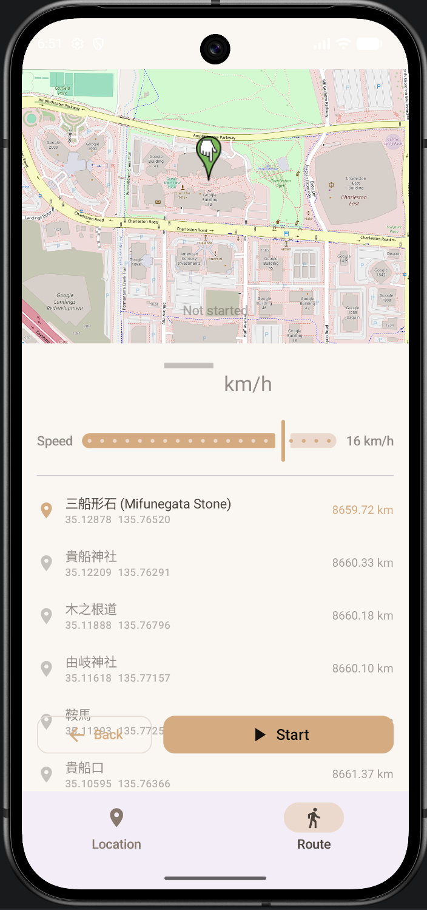

# GPS Anywhere

A lightweight Android tool for developers and testers to simulate GPS locations and walking routes without Google Play Services.

> For development and testing only. GPS spoofing may conflict with app terms or regulations in some regions.

## Screenshots

<p align="center">
  
  &nbsp;&nbsp;
  
  &nbsp;&nbsp;
  
</p>

## Quick Start

1. Clone the repo and open in Android Studio (Ladybug+ recommended).
2. On your device: enable Developer Options → select "GPS Anywhere" as the mock location app.
3. Build and run: `./gradlew assembleDebug` or use Android Studio Run.

Without the mock location setting, the app installs but will not spoof.

## Core Capabilities

- Master toggle for instant real vs. spoofed GPS switching
- Map-based pinning, Google Maps coordinate paste, or manual lat/long entry
- Persistent foreground service with notification controls
- History of recent locations with rename, delete, and restore
- OSRM-powered route walking simulation with speed controls and saved routes

## Technology

| Area              | Choice                          |
|-------------------|---------------------------------|
| Language          | Kotlin                          |
| UI                | Jetpack Compose + Material 3    |
| Maps              | OSMDroid (offline tile support) |
| Routing           | OSRM (no API key required)      |
| Persistence       | Room + KSP                      |
| Mock Provider     | LocationManager test provider   |
| Background        | Foreground Service              |
| Min SDK           | API 24 (Android 7.0)            |

Package: `com.gpsanywhere.app`

## Project Layout

```
app/src/main/java/com/gpsanywhere/app/
├── ui/               # Compose screens and shared components
├── viewmodel/        # State holders per screen
├── service/          # SpoofService (foreground)
├── data/             # Room database + DAOs
├── settings/         # SharedPreferences wrappers
├── directions/       # OSRM client
└── routes/           # Domain models
```

## Device Permissions

- ACCESS_FINE_LOCATION / ACCESS_COARSE_LOCATION — map centering
- ACCESS_MOCK_LOCATION — required for spoofing
- FOREGROUND_SERVICE / FOREGROUND_SERVICE_LOCATION — background operation
- POST_NOTIFICATIONS — persistent status on Android 13+
- INTERNET / ACCESS_NETWORK_STATE — map tiles + OSRM

## Build Notes (AGP 9 + Kotlin 2.0)

- AGP 9 bundles Kotlin; do not declare the kotlin-android plugin.
- Use the Compose Gradle plugin (`org.jetbrains.kotlin.plugin.compose`).
- Room compilation uses KSP, not kapt.
- Set `android.disallowKotlinSourceSets=false` in gradle.properties.
- Only `compileOptions` is used; `kotlinOptions.jvmTarget` is removed.

## License & Responsibility

Educational and internal testing use only. Respect the terms of any apps or services you interact with while using simulated locations.