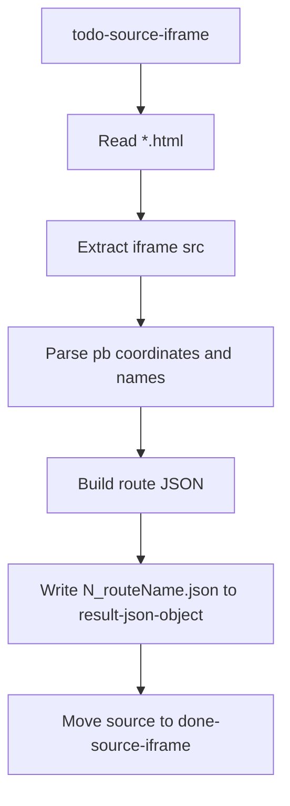

# Build Go Iframe-to-JSON Converter

## Scope
Build a fresh Go project in this repo that:
- Reads `.html` files from a todo folder.
- Extracts Google Maps embed points from iframe `src` (`pb=` payload) into JSON coordinates.
- Writes output JSON files to a result folder.
- Moves successfully processed source files into a done folder.

## Assumptions (based on your choices)
- Input format is one iframe per `.html` file.
- Output file uses the same base route name with an auto-increment numeric prefix from existing result JSONs.
- Example: existing latest `04_taipei_city_1.json` -> next generated file starts with `05_`.
- `version` defaults to `1`.
- `route_name` is derived from source filename (without extension, normalized for display).
- Since `route_id` field format was not finalized, default to slug-from-route-name (e.g. `tainan-city-1`) while keeping numeric prefix only for output filename.

## Planned Project Layout
- `cmd/iframe2json/main.go` - CLI entrypoint and folder orchestration.
- `internal/config/config.go` - directory paths and defaults.
- `internal/parser/iframe.go` - iframe extraction and `pb` parsing.
- `internal/model/route.go` - JSON struct definitions.
- `internal/pipeline/process.go` - file loop, naming, write+move flow.
- `todo-source-iframe/`, `result-json-object/`, `done-source-iframe/` - runtime directories.
- `README.md` - usage and filename conventions.

## Conversion Flow

## Parsing Rules
- Parse `<iframe ... src="...">` and read the URL query param `pb`.
- Walk the decoded `pb` token sequence and detect each location group:
  - name token (`2z...` URL-encoded text)
  - latitude token (`1d...`)
  - longitude token (`2d...`)
- Preserve point order from source.
- Skip malformed point groups with warning logs; continue processing the file.

## Filename/ID Rules
- For each source like `tainan_city_1.html`:
  - route base = `tainan_city_1`
  - next prefix = max existing numeric prefix in result directory + 1 (zero-padded to 2 digits)
  - output filename = `05_tainan_city_1.json`
  - route_name = `tainan_city_1`
  - route_id (default) = `tainan-city-1`

## Validation & Logging
- Ensure required directories exist (create if missing).
- Process all `.html` files in one run.
- Log per file: processed, skipped, parse errors.
- Non-fatal errors on one file do not stop the batch.

## Verification
- Add a sample input file and run converter once.
- Confirm:
  - JSON appears in result directory with incremented prefix.
  - Source file moves to done directory.
  - Coordinates and names match iframe points.
